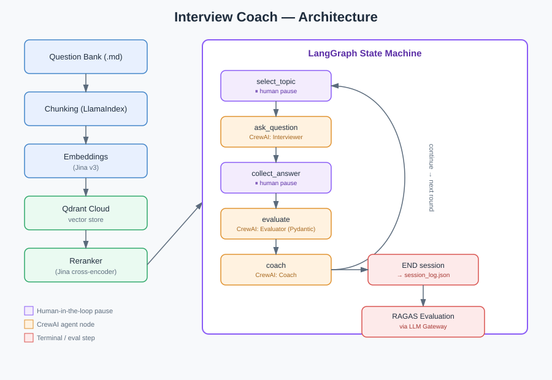

# Interview Coach

<p align="center">
  
  
  
  
  
  
</p>

A multi-agent, agentic RAG system that runs live technical interview practice sessions — asks questions grounded in a real knowledge base, grades your answers against a rubric, gives actionable coaching feedback, and evaluates its own output quality automatically.

Built to demonstrate end-to-end agentic AI engineering: retrieval, multi-agent orchestration, human-in-the-loop control flow, structured output validation, evaluation, and reliability engineering — not just a single framework demo.

<p align="center">
  
</p>

---

## Screenshots

*(Add your own screenshots here once you have a session running — see instructions below.)*

<p align="center">
  
</p>


## What it does

1. You pick a topic from a pool (RAG, vector databases, LLM systems, etc.)
2. An **Interviewer** agent retrieves relevant context and asks a question grounded in it
3. You answer
4. An **Evaluator** agent grades your answer 1–5 against the retrieved rubric, with structured, schema-validated output — not free text
5. A **Coach** agent gives specific, actionable feedback on what to study next
6. The session repeats across topics, tracking which ones you're weak on
7. After the session, a separate evaluation pass (RAGAS) checks whether the agents' outputs were actually grounded in retrieved context, not hallucinated

---

## Architecture

See the diagram at the top of this README for the full visual flow. In short:

**Ingestion** → chunk the markdown question bank (LlamaIndex) → embed (Jina) → store in Qdrant.

**Retrieval** → dense search over Qdrant → cross-encoder rerank (Jina) → top-k relevant chunks.

**Session orchestration (LangGraph)** → `select_topic` (human pause) → `ask_question` (CrewAI Interviewer) → `collect_answer` (human pause) → `evaluate` (CrewAI Evaluator, Pydantic-validated output) → `coach` (CrewAI Coach) → loop or end.

**Post-session evaluation** → `session_log.json` → RAGAS faithfulness/relevancy scoring via the LLM Gateway.

---

## Tech stack

| Layer | Tool | Why |
|---|---|---|
| Ingestion & chunking | LlamaIndex | Document parsing, sentence-aware chunking |
| Embeddings | Jina Embeddings v3 | Asymmetric query/passage embeddings |
| Vector store | Qdrant Cloud | Production-grade ANN search, metadata filtering |
| Reranking | Jina Reranker v2 | Cross-encoder second-stage precision boost |
| Agent roles | CrewAI | Interviewer / Evaluator / Coach role-based agents |
| Orchestration | LangGraph | Control flow, human-in-the-loop pausing, conditional routing |
| Structured output | Pydantic | Schema-validated Evaluator output, retry on validation failure |
| LLM backend | DeepSeek via OpenRouter | Free-tier LLM access |
| LLM Gateway | Custom (litellm-based) | Fallback chain, response caching, cost/latency tracking |
| Evaluation | RAGAS | Faithfulness & answer relevancy scoring (LLM-as-judge) |
| UI | Streamlit | Interactive session interface |
| Reliability | Custom retry/logging utils | Exponential backoff, structured logging, graceful degradation |

---

## Project structure

```
interview-coach/
├── data/questions/            # Markdown knowledge base (Q&A + rubrics)
├── src/
│   ├── ingestion/loader.py    # Chunking
│   ├── indexing/
│   │   ├── embeddings.py      # Jina embedding calls
│   │   ├── qdrant_store.py    # Vector store + retrieval
│   │   └── reranker.py        # Cross-encoder reranking
│   ├── agents/
│   │   ├── crew.py            # CrewAI agent definitions
│   │   ├── tools.py           # Retrieval tool for agents
│   │   └── schemas.py         # Pydantic output schemas
│   ├── graph/
│   │   ├── state.py           # LangGraph state schema
│   │   └── session_graph.py   # Graph nodes, edges, orchestration
│   ├── eval/
│   │   └── ragas_eval.py      # Post-session RAGAS evaluation
│   ├── utils/
│   │   ├── logging_config.py  # Centralized logging
│   │   ├── retry.py           # Exponential backoff decorator
│   │   └── llm_gateway.py     # Fallback + caching + cost tracking
│   └── ui/
│       └── app.py             # Streamlit interface
├── .env                        # API keys (not committed)
└── requirements.txt
```

---

## Setup

### 1. Prerequisites
- Python 3.13 (avoid 3.14 — some dependencies lack prebuilt wheels for it as of this writing)
- A [Qdrant Cloud](https://cloud.qdrant.io) free-tier cluster
- A [Jina AI](https://jina.ai/embeddings) API key (free tier)
- An [OpenRouter](https://openrouter.ai) API key (free-tier DeepSeek access)

### 2. Environment
```bash
python -m venv venv
# Windows:
.\venv\Scripts\activate
# macOS/Linux:
source venv/bin/activate

pip install -r requirements.txt
```

### 3. Configure `.env`
```
QDRANT_URL=https://your-cluster-url.cloud.qdrant.io
QDRANT_API_KEY=your-qdrant-api-key
JINA_API_KEY=your-jina-api-key
OPENROUTER_API_KEY=your-openrouter-api-key
```

### 4. Index the knowledge base
```bash
python -m src.indexing.qdrant_store
```

### 5. Run a session

Terminal:
```bash
python -m src.graph.session_graph
```

Or the Streamlit UI:
```bash
streamlit run src/ui/app.py
```

### 6. Evaluate a completed session
```bash
python -m src.eval.ragas_eval
```

---

## Design decisions worth highlighting

- **LangGraph vs CrewAI split**: CrewAI defines *who* does the reasoning (agent roles, tools); LangGraph controls *when* and *in what order*, including genuine human-in-the-loop pausing (`interrupt()`/`Command(resume=...)`) that CrewAI's sequential process alone can't do.
- **Explicit retrieval over implicit tool-calling**: nodes retrieve context directly rather than trusting agents to call the search tool reliably — this also makes retrieved context available for RAGAS evaluation afterward, which implicit tool-calling wouldn't expose.
- **Structured output over regex parsing**: the Evaluator's score/justification is validated against a Pydantic schema with retry-on-failure, replacing a fragile "scan the text for a digit" approach.
- **Graceful degradation**: every agent call and retrieval call is wrapped with fallback behavior — a failed LLM call doesn't crash the session, it degrades to a fallback message and continues.

---

## Known limitations

- Knowledge base is currently small; retrieval hasn't been stress-tested at scale
- Score extraction reliability depends on the LLM's schema-following consistency, not just prompt wording
- No persistent storage across sessions — `session_log.json` is overwritten per run
- LLM Gateway is applied to the RAGAS evaluation path, not (yet) to the CrewAI agents' internal calls
- No automated CI regression testing on the eval pipeline itself yet

---

## License

Personal portfolio project — not licensed for reuse.
